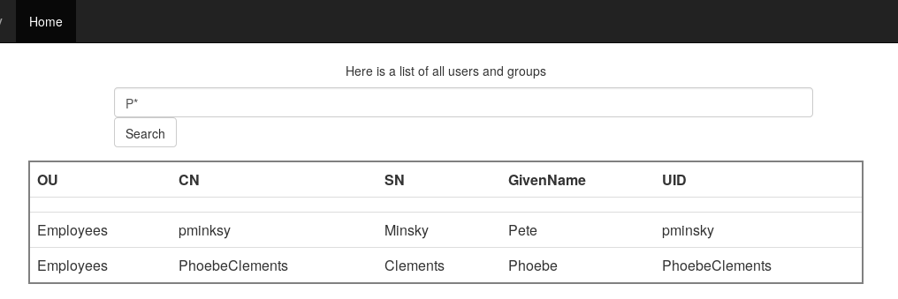

LDAB (>400 solves)
---

Judging from the title of the challenge and the website, it's straightforward LDAP injection.

Searching `*` lists all employees, and narrowing this down to `P*` shows it is the GivenName field being filtered.

Only `ou=Employees` are listed and at first I worked on getting other other OUs to display. After not having success with that, I wondered if the backend query might look like:

`(&(GivenName=" + input + ")(flag=false))`

Which is ANDing the two conditions. This can be undone with an LDAP injection that I've used before to bypass a login form: `*)(cn=*))(|(cn=*`.

On the backend this essentially turns the AND into an OR with `cn=*`, which will match everything:

`(&(GivenName=*)(cn=*))(|(cn=*)(flag=false))`

And indeed this prints the flag. A more specific solution would be: `*)(cn=flag*))(|(cn=*`

