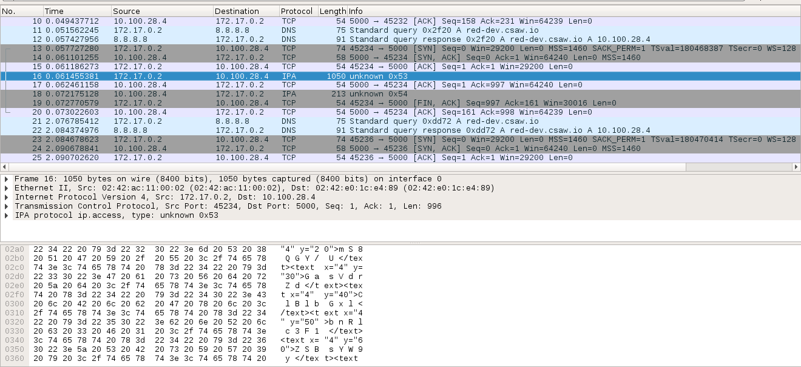
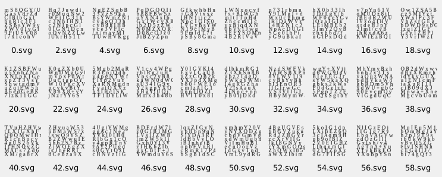
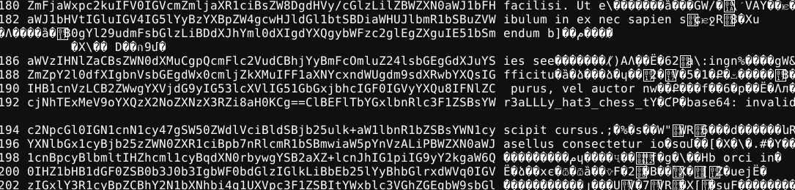
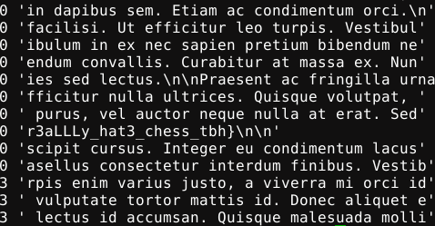

mcgriddle (~40 solves)
---

> All CTF players are squares

We are given a PCAP file containing a network chess game. A Class B private address is playing the black pieces against a Class A private address server, which opens Nf3.

The notable thing is that the player is sending SVGs after each one of its moves, titled with even numbers. These contained strange ASCII, so we extracted them with an amazing PCAP parser *cough* Bash:

`mkdir svgs; i=0; while read p; do echo $p > svgs/$i.svg; ((i+=2)); done < <(strings final.pcap | grep "<svg")`

101 8x8 grids of characters. Because they are not particularly useful in SVG format, we grabbed the text only:

`i=0; while read p; do echo -n "$i "; echo -n $p | sed -e 's/<[^>]*>//g' | tr -d ' '; ((i+=2)); echo; done < <(strings final.pcap | grep "<svg")`

Which is now clearly base64-encoded data. Our next improvement to the pipeline was to base64-decode the data alongside:

`i=0; while read p; do echo -n "$i "; echo -n $p | sed -e 's/<[^>]*>//g' | tr -d ' '; echo -n ' '; echo -n $p | sed -e 's/<[^>]*>//g' | tr -d ' ' | base64 -d; ((i=i+2)); echo; done < <(strings final.pcap | grep "<svg")`

Fragments of Lorem ipsum text, what appears to be part of the flag (#192), and a whole lot of garbage.

We spent a long time on this step, trying many theories which led nowhere. Were the chess moves indexes into the base64 charset? Were the grids rotated in some way? Was it a famous chess game? We converted the moves into [PGN format](https://en.wikipedia.org/wiki/Portable_Game_Notation) and loaded it into the [Lichess analysis board](https://lichess.org/analysis) and wrote a lot of code.

Looking closer at the base64-encoded and decoded data, there were interesting patterns. From moves 144-196 there was a contiguous run of meaningful text at the start of the decoded fragment. In other sections, there were runs of meaningful text in the middle, or at the end.

Crypto-expert [holocircuit](https://github.com/holocircuit) made a breakthrough, noting that the first move corresponds to meaningful text in the centre, with roughly equal amounts of garbage on either side. Like how a chessboard is setup at the beginning of game, with empty space in the middle and all the pieces at the top or the bottom. Could the empty spaces on the chessboard at any given point in the game indicate letters to select in the relevant 8x8 grid of base64 characters?

[mcgriddle.py](mcgriddle.py) implements this, playing through the game move-by-move with [python-chess](https://github.com/niklasf/python-chess), using its board representation to index the base64 strings. Most difficult to get right was handling of uneven or unaligned base64 characters, so we front-pad the data until it prints out as ASCII.

This revealed a whole lot more Latin and more of the flag, and we felt we were seconds away from scoring 300pts. However, we couldn't find the remaining part of the flag. We wasted a lot of time fruitlessly trying to figure out what we had missed, tweaking the code and riffling through the PCAP seeking extra clues. Eventually we got tired, and gave up.

Unfortunately it turned out that earlier versions of the PCAP file actually contained the full flag, but the 'final.pcap' that most teams had downloaded was broken. That's extremely lame, but par on course for this CTF, in which none of the forensics challenges were of the quality we expected from CSAW.
