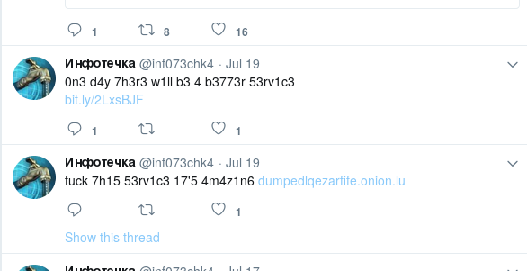
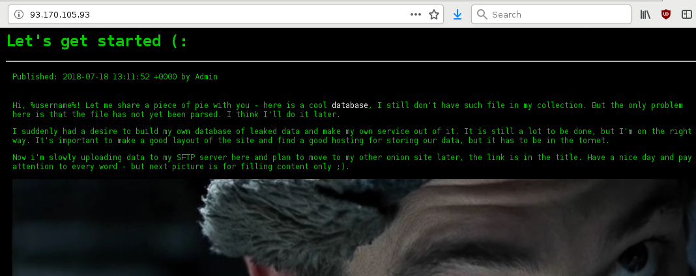
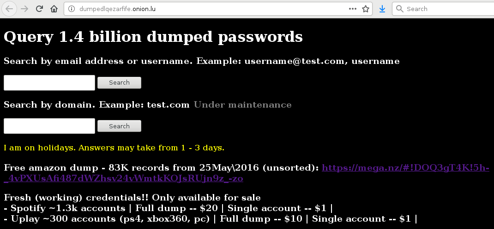

Hidden Dispute (20 solves)
---

SKETCHY challenge!

> So, @inf073chk4, our dispute is still on! I've promised to hack all your hidden services and, believe me, I'll do it!

Finding the handle on Twitter:

This Russian appears to be very interested in password dumps. Further down the page are two suspicious links:

The first site gives some clear leads about what to research next (but note that the onion site referred to in the title was inactive):

The second is a scummy looking hidden service accessed through a HTTP(!) Tor gateway:

Both sites provide a free leak of Amazon credentials, a kind of freebie ~~hacker-mercenaries~~script-kiddies offer to prove they're "legit". The hidden service has an haveibeenpwned-style creds search engine, except that it actually shows the passwords. And the list seems rather comprehensive. Lastly, the source code contains a Neuromancer quote about the consensual hallucination of cyberspace. The challenge wins top marks for style.

Our next step was to search for the hacker in his own credentials dump. Sure enough, a password for his mail.ru account appeared. It worked as an SFTP login on the first website. However after poking around a bit, we found that SFTP was completely locked down. Trying SSH next, we were immediately logged-out&mdash;however, not before some stderr flashed up, "could not change directory to /sftp/s00zaran".

The challenge was drip-feeding us clues. After heading down the wrong track a few times, we returned back to nmap scans kicked off in the background, and discovered that the hidden service mentioned by the first website, which did not appear to be up, actually had an open port 22. We used a locally-compiled version of proxychains4 as the SOCKS proxy for these scans, as other software (proxychains3, torify) didn't play nice with nmap.

Trying 's00zaran' as the SSH login for the hidden service, along with the password from the leak, gave the flag.

A lesson about credentials reuse, especially for aspiring script-kiddies. But surely [real cybercriminals aren't that stupid?](https://www.bleepingcomputer.com/news/security/crooks-reused-passwords-on-the-dark-web-so-dutch-police-hijacked-their-accounts/)
