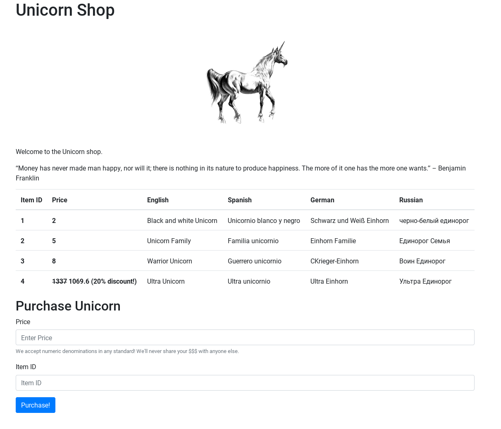
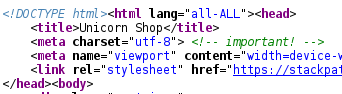
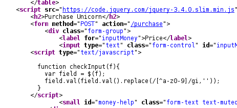

Unicorn Shop (26 solves)
---

**Team:** the cr0wn

A web challenge which at first seemed frustrating and obscure, but actually turned out to be fair, prompting research into the security considerations of Unicode.

### Enumeration

We have a website with a table of items on offer, and two parameters that can be posted:



By briefly playing around with those parameters, we find we can buy the first three items (which display pictures of unicorns), but not the fourth. We initially guess that:
 - We own 9 coins, since inputting 10 or more as the price sends us to the generic error page.
 - If we can buy the fourth item, we will get the flag.

The source contains further clues:



Apparently it's important that the charset is UTF-8. That's a strange clue, since [over 93% of websites](https://w3techs.com/technologies/overview/character_encoding/all) use UTF-8 encoding. Perhaps the real hint here is that mixing up different character sets with UTF-8 will be involved, or simply that character encoding _in general_ will be key to solving the challenge.



This second clue in the source reinforces this. The JS is trying to restrict us from doing anything non-alphanumeric with the price field.

### UTF-8

Before going any further; a brief refresher on UTF-8. It's the most popular Unicode encoding by far because it is backwards compatible with ASCII. It is variable-width, using one, two, three, or four bytes as necessary to represent all of the 1,112,064 Unicode code points.

The more common code points are in the lower range therefore requiring fewer bytes to represent, with the first half of single-byte encodings being equivalent to the 128 characters of ASCII. In the higher ranges, there's a whole bunch of odd stuff. For instance, the [Unicode unicorn](https://www.compart.com/en/unicode/U+1F984), 🦄, is represented by the four bytes 0xF0 0x9F 0xA6 0x84, which can be urlencoded as %F0%9F%A6%84.

### Unicode &amp; security

UTF-8 sounds great in theory, but along with the rest of Unicode, it has warts. The most famous case of this is domain name spoofing using [Punycode](https://en.wikipedia.org/wiki/Punycode), but there are other, lesser-known spoofs too.

We found a ["Unicode Technical Report"](http://unicode.org/reports/tr36/tr36-3.html#Numeric_Spoofs) very useful in understanding further abuses that Unicode might allow, with the section on "numeric spoofs" being especially relevant.

### All standards accepted

Below the price field is a comment "we accept numeric denominations in any standard"! After being inspired by the above report, we realised that numeric characters in any script, i.e. Bengali, Arabic, Chinese etc. were accepted as valid currency by the shop.

The client-side check that only alphanumeric stuff was being entered was clearly not being mirrored on the backend.

Nevertheless, we still couldn't "afford" item #4, the digit values in different scripts got interpreted the same way as European digits. We were seemingly still too poor regardless of the digits used  😢

### Ethiopian numbers

Following further experimentation, we found that the actual check being applied on the backend was that we were only allowed to submit a single character. We could buy the third unicorn by inputting 9 into the price field, but not 10, but we _could_ buy it with Ⅹ (Roman numeral for 10). This made the solution clear.

Searching "thousand" in a Unicode code point website shows a large range of single numeric characters that can represent numbers in the tens of thousands and even millions! We chose ["Ethiopic Number Ten Thousand"](https://www.compart.com/en/unicode/U+137C) due to its groovy appearance and used that to purchase the fourth unicorn, and obtain the flag.

Final request:
```bash
curl 'http://104.248.237.208/purchase' -H 'Content-Tyn/x-www-form-urlencoded' --data 'id=4&imoney=%E1%8D%BC'
```
