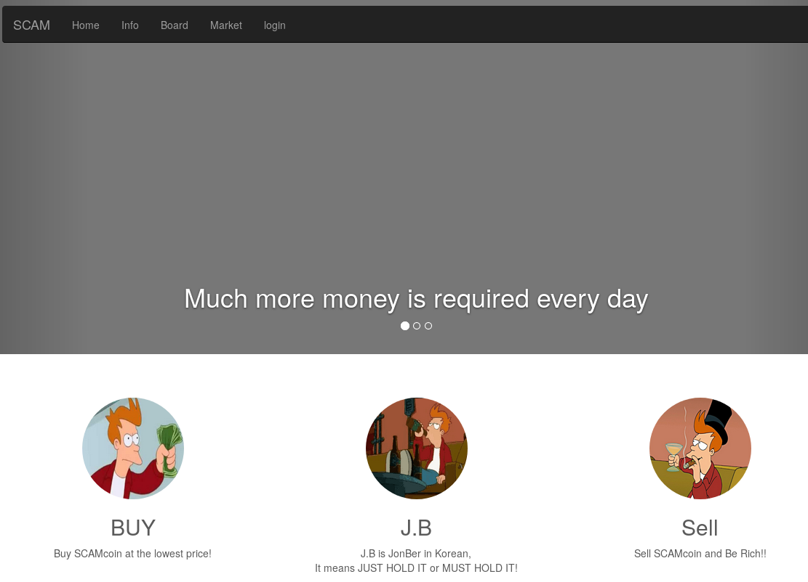
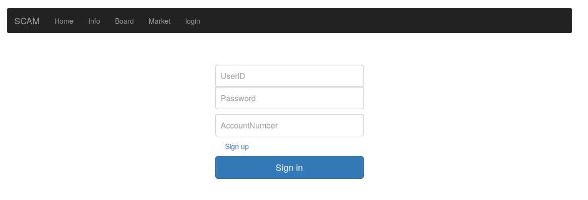
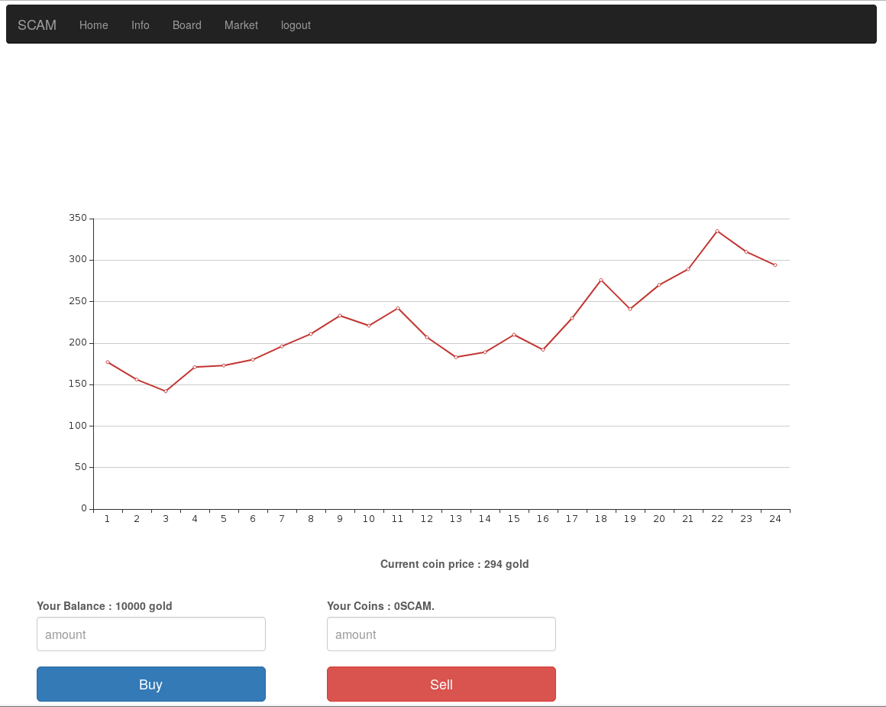
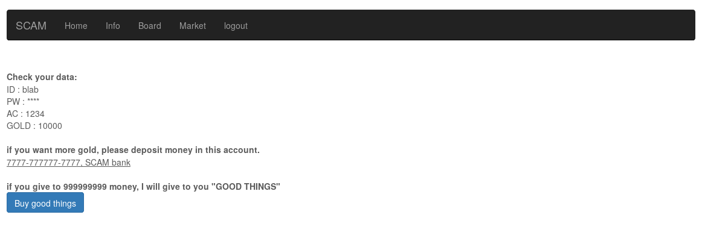
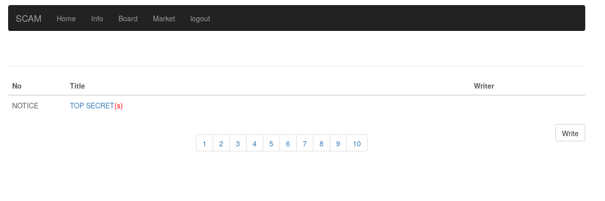
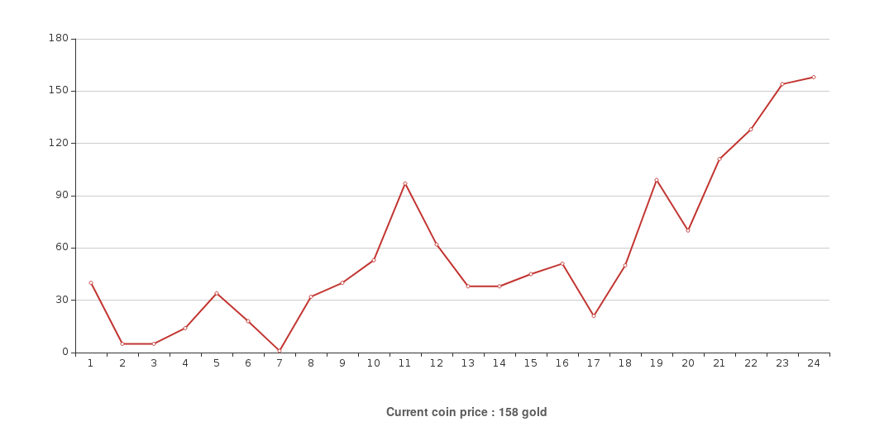
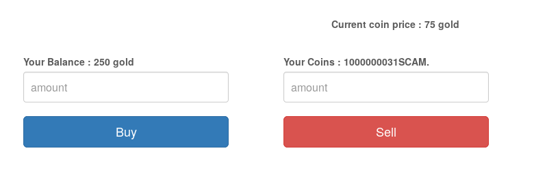

Rich Project (23 solves)
---
**Team:** the cr0wn

A wacky web challenge in this wacky Korean CTF.

### Enumeration

We have a website that pokes fun at last years' cryptocurrency craze:



No functionality is available until we login. The login form includes an additional AccountNumber field besides username and password:



Once registered and logged-in, we see a rudimentary cryptocurrency exchange. We are given 10000 gold by default and the price fluctuates each time the page is refreshed:



The info page promises "GOOD THINGS" if a huge amount of gold is paid:



Finally, there's a bulletin board-style page where we have to be admin to view the TOP SECRET entry:



In short, that's a lot of potential entry points. Our scans also identified a robots.txt entry:

```
User-agent : *
Disallow: /top_secret.zip
Disallow: /
```

This "top secret" zipfile's listing turns out to contain the source code for the entire challenge, but the files are encrypted of course:

```
$ 7z l top_secret.zip
...

   Date      Time    Attr         Size   Compressed  Name
------------------- ----- ------------ ------------  ------------------------
2019-01-26 10:31:57 D....            0            0  __SECRET__
2019-01-15 06:52:59 ....A          133          124  __SECRET__/flag.php
2019-01-15 08:29:29 ....A          674          352  __SECRET__/pricemaker.php
2019-01-26 10:31:57 D....            0            0  html
2019-01-26 10:34:24 ....A         1506          732  html/bbs.php
2019-01-26 10:32:39 ....A         1019          538  html/buy.php
2019-01-26 10:31:57 D....            0            0  html/css
2018-06-12 13:30:53 ....A       117418        19249  html/css/bootstrap.min.css
2019-01-02 02:26:10 ....A         2538          927  html/css/carousel.css
2019-01-02 05:27:54 ....A          767          303  html/css/signin.css
2019-01-15 07:07:21 ....A          201          140  html/dbconn.php
2019-01-15 06:42:36 ....A          233          128  html/footer.php
2019-01-15 07:54:52 ....A         1903          725  html/header.php
2019-01-15 06:25:47 ....A         2656          706  html/home.php
2019-01-26 10:31:57 D....            0            0  html/images
2019-01-02 00:22:05 ....A       133008       132963  html/images/buy.png
2019-01-02 00:41:49 ....A        12830        12826  html/images/JB.jpg
2010-05-19 02:36:16 ....A        40394        39583  html/images/rich.jpg
2019-01-15 07:54:42 ....A         1237          269  html/index.php
2019-01-15 06:32:24 ....A          947          513  html/info.php
2019-01-26 10:31:57 D....            0            0  html/js
2018-06-12 13:30:53 ....A        35652         9472  html/js/bootstrap.min.js
2018-11-17 17:40:53 ....A       456243        93107  html/js/canvasjs.min.js
2019-01-04 01:00:44 ....A       305436       104999  html/js/echarts.simple.min.js
2018-06-12 13:30:53 ....A        23861         8692  html/js/holder.js
2018-06-12 13:30:53 ....A         2132         1033  html/js/ie-emulation-modes-warning.js
2018-06-12 13:30:53 ....A          694          438  html/js/ie10-viewport-bug-workaround.js
2016-12-20 18:17:03 ....A        95931        33315  html/js/jquery.min.js
2019-01-15 08:25:59 ....A         1389          648  html/login.php
2019-01-15 06:30:56 ....A           71           79  html/logout.php
2019-01-15 06:45:47 ....A         3464         1299  html/market.php
2019-01-15 06:48:26 ....A          366          284  html/pay.php
2019-01-15 07:01:10 ....A          998          517  html/read.php
2019-01-15 07:03:04 ....A         1675          781  html/reg.php
2019-01-26 11:30:38 ....A          922          537  html/reserv.php
2019-01-10 01:05:30 ....A           53           57  html/robots.txt
2019-01-26 10:32:38 ....A          977          510  html/sell.php
2019-01-15 06:48:52 ....A         1235          579  html/write.php
2019-01-15 07:55:54 ....A            0            0  ZIP PASS = MASTER_PW
------------------- ----- ------------ ------------  ------------------------
2019-01-26 11:30:38            1248563       466425  34 files, 5 folders
```

We spent a while browsing the website and attempting various attack vectors, particularly on the market page, without success.

### Cracking the zip

It suddenly occurred to us that the zipfile might be vulnerable to a [known plaintext attack](https://www.elcomsoft.com/help/en/archpr/known_plaintext_attack_(zip).html).

Indeed, the file used the old, weak ZipCrypto algorithm rather than AES:

```
$ 7z l -slt top_secret.zip | grep Method
Method = Store
Method = ZipCrypto Deflate
...
```

The attack's speed depends on the size of the known plaintext, so it was good that there were several large files inside. However, running [pkcrack](https://www.unix-ag.uni-kl.de/~conrad/krypto/pkcrack.html) with correct parameters returned the following error:

```
Read unknown signature: 0xfd054e2f
Error: unknown signature (ZIP file may be corrupt)
```

Not to worry, another program [bkcrack](https://github.com/kimci86/bkcrack) knew how to crack the file and we got the archive password: `D0_N0T_RE1E@5E_0THER5`.

### Reviewing the code

At this point we grepped through the source code, and found that indeed we needed to obtain 999999999 gold to get the flag, due to `include '../__SECRET__/flag.php';` being in pay.php - note that the flag was blanked out in our copy of the file. Throughout the code, there were some odd sections, such as abusive references to the old admin:

```php
html/write.php:    if($_SESSION['ID'] === "admin")
html/write.php-        die('Do not write more article. You fired.');
```

Initially we assumed we would be able to find a SQL injection, or predict/manipulate the exchange to gain coins at zero cost, since we had seen the exchange price drop to zero on the chart:



### Becoming crypto-millionaires

In fact, we soon figured out that the reserv.php file potentially offered the path to riches. This file had a check:

```php
$time = strtotime($_POST['date']);
if($time === NULL || $time < 0)
    die("detect input error");
if($time < time() || $time > time()+60*60*24*365*20)
    die("detect input error");
```

It seemed difficult to bypass; whatever date format or time we used, we got "detect input error".

Eventually we guessed that the current time on the backend server may have been set incorrectly, and by fuzzing the field, found that 2020/01/01 got us through. Pretty bad for a financial website, but it's cryptocurrency so YOLO...

Digging more deeply into the code, reserv.php allowed a user to make a forward contract, which would get executed at the market rate when the market.php page was visited at that time. However there is an error in the following code:

```php
### if reserv is exists
$q = "SELECT * FROM coin_price where Date like '%{$row['reserv']}%' order by Date limit 1";
$res = mysqli_query($conn,$q);
$row2 = mysqli_fetch_assoc($res);
if($row['cash'] < $row2['price']*$row['amount'])
    echo "Not enough cash to buy SCAM coin. your reservation is failed..</br>"; 
else
{
    $cash = $row['cash'] - ($row2['price'] * $row['amount']);
    $coin = $row['coin'] + $row['amount'];
    $q = "UPDATE user_wallet set amount=0, reserv='9999-12-30',cash='{$cash}', coin='{$coin}' where id='{$_SESSION['ID']}'";
...
```

Regardless of whether a coin price has been pulled from the database, $amount of $coin are added. So after making a forward contract, we immediately visit market.php and receive our scamcoins.

Therefore, the following request was sufficient to grant us a huge quantity of scamcoins:

```bash
curl -s -X POST 'http://110.10.147.112/?p=reserv' -H 'Host: 110.10.147.112' -H 'Cookie: PHPSESSID=xxxxxxxxxxxxxxxxxxxxxxxxxx' -F 'code=D0_N0T_RE1E@5E_0THER5' -F "date=2020/01/01" -F 'amount=100000000'
```



We used these to buy gold on the exchange, which was more difficult than first anticipated, because if you bought too many a wraparound would occur and your balance would go back to zero.

The gold was then used to purchase the "GOOD THINGS"/the flag, which contained an obscure joke about [HODLING](https://en.wikipedia.org/wiki/Hodl) cryptocurrency.

We are not sure whether any of part of this writeup was the intended solution. We never took advantage of a SQL injection in the AccountNumber field, or the BBS, and the weak encryption on the zipfile may have been a mistake, but it was still a fun challenge and we appreciate the jokes and the fact that the source code was shared.
