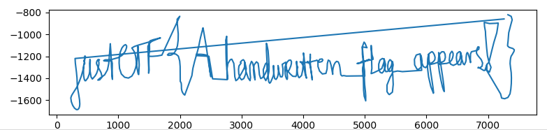
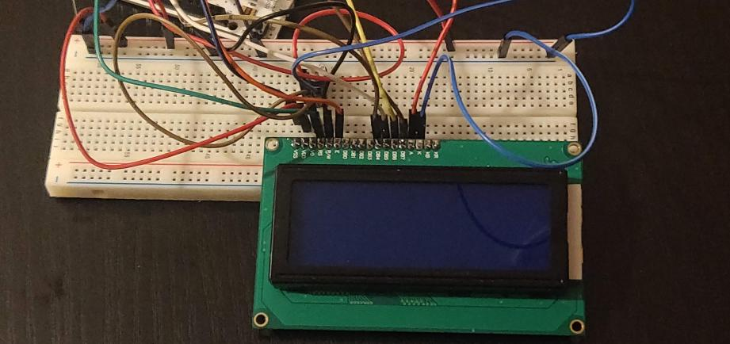

justCTF 2019
---

I played this CTF with the team **Cr0w**, plenty of the credit for these solves goes to members of that team especially Robin, pogo, Lia, and Cr0wn\_Gh0ul. The CTF had a good mix of entertaining challenges; I particularly liked how it showcased a broader range of STEM fields rather than just typical CTF fare.


### Firmware Updater

```
This device need a firmware! Upload and execute ASAP!

Flag is in /etc/flag

http://firmwareupdater.web.jctf.pro/
```

Whenever you see a Zip file upload in a CTF challenge these days, there's a very high chance there's a [Zip Slip vulnerability](https://snyk.io/research/zip-slip-vulnerability) involved. See for instance [HackTheBox Ghoul](https://medium.com/bugbountywriteup/hackthebox-ghoul-deb77ff43326).

The Zip Slip attack arises from the fact that it's possible to archive relative paths to files, for instance `../../../../etc/passwd`, and this relative path is preserved even when extracted on a different system. Naive backend code may extract the contents of such a malicious zipfile over the top of important files.

This challenge is a slight variation on that theme. We can see that the website extracts our archive and then cats `README.md`. This suggests that we need to use that file directly to read the flag. It turns out that you can preserve symlinks inside zipfiles:

```
ln -s /etc/flag README.md
zip --symlinks exploit.zip README.md
```

After uploading exploit.zip, the server reads the flag for us 'through' README.md.


### md5service

```
I found this md5service. I heard that md5 in 2019 is a joke, can you prove me wrong?
```

Connecting, we get: 
```
Welcome to md5service!
I have two commands:
MD5 <file>     -- will return a md5 for a file
READ <file>    -- will read a file
Cmd:
```

We try some things, and quickly notice that `MD5 *` returns a hash, but `READ *` gives no result.
Through guessing it turns out that `READ md5service.py` shows the source code of the challenge. The only really interesting parts are a comment:
```
The flag is hidden somewhere on the server, it contains `flag` in its name
```

And the method that is called when we use the `MD5` command:
```
def md5_file(filename):
    out = subprocess.check_output(['/task/md5service.sh'], input=filename.encode(), stderr=subprocess.DEVNULL)
    return out
```

which plugs into md5service.sh:
```
#!/bin/bash                                                                                                                                                                               

read x;
y=`md5sum $x`;
echo $y | cut -c1-32;
```

Note that this Bash script does not allow command injection due to the way our input is fed directly into a variable with `read`. However, the script does allow [filename expansion](https://www.gnu.org/software/bash/manual/html_node/Filename-Expansion.html#Filename-Expansion). Which is why `MD5 *` worked originally, expanding into the filenames in our pwd and giving us the hash of the first one.

My teammate Robin quickly realised how to use this to find the location of the flag on the filesystem, and saw that `MD5 /*/flag*` successfully returns a hash.

From here, we can bruteforce the location of flag one byte at a time, when we see `MD5 /0*/flag*` getting successfully expanded but not `MD5 /1*/flag*` and so on.

After bruteforcing the flag file's name, we just view it with the `READ` command.


### p&q service

```
Let's play the game. You give me p and q along with the calculated cipher and I will try to guess the e and decipher the text. Just encrypt the justGiveTheFlag!! word and I will give you the flag! Hopefully...
```

This was a cool RSA-like challenge that asked us to exploit an oddity of multiplicative modular groups.

We input primes p and q, and a ciphertext to the server. It validates the primes are strong, calculates random but RSA-conforming e and d, decrypts our ciphertext, and checks that our plaintext exactly matches 'justGiveTheFlag!!' after removing padding.

At first it seems impossible to produce a specific ciphertext when we don't know the public or private exponent, however there are a few things here working in our favour:
  1. The padding function just looks at the last byte of the plaintext and removes the corresponding number of bytes from the message.
  1. We are in total control of the modulus, and can take advantage of the weirdness of modular math :D

Our first idea was to use the fact that `(n-1) ^ e % n` cycles between just two values, `n-1` when `e` is odd, and `1` when `e` is even. RSA requires odd exponents anyway, so after applying the exponent, `n-1` is unchanged modulo n.

We then search for two primes which when multiplied give us an n of the form `'justGiveTheFlag!!' + JUNK + NUM_BYTES_TO_UNPAD+1`. We subtract one from this, submit that as the ciphertext along with the p and q that we found, and the server will strip off the junk bytes leaving us with just the message as plaintext. Great.

However, this approach runs into a small but insurmountable issue. Due to the primes needing to be ~256 bits, we have to use exactly 47 bytes of junk and a final byte of 0x30 (48) to get a modulus and ciphertext which not only unpad the correct amount but are also within the allowed bitsize of 508-512. However, 0x30 is even and it's thus impossible for two large primes to multiply to a number that ends with that byte. If we set it to 0x29, then our plaintext would be unpadded one byte too few, and decrypt to 'justGiveTheFlag!!\\x01' - close, but no cigar.

The real solution which we didn't discover until later, is to use a slightly more sophisticated nuance of modular math, which is that `p^e % (p*(p-1)) = p`

To gain an intution for how this works, here's an example with `p = 19`. As the exponent on p increases, the difference between `p^e` and the modulus remains a multiple of 19, so the exponent once again doesn't actually matter. 
```
e  p^e    p*(p-1)  p^e - p*(p-1)      p^e % (p*k(p-1))
1  19     342      -323   = -17*19    19
2  361    342      19     = 1*19      19
3  6859   342      6517   = 343*19    19
4  130321 342      129979 = 6481*19   19
```

It's easiest to see this with the 19^2 case. Clearly 19\*19 mod 19\*18 is 19, and by further incrementing the exponent, we are just successively multiplying the LHS by 19 which doesn't change the output mod 19.

So `p*(p-1)` as modulus seems to work out nicely, however in this challenge we need q to be a prime, so we can't simply use `p-1` for q as it would be a even number.

If we use a factor of `p-1`, such as `(p-1)/2` instead of `p-1`, then our modulus becomes `p*(p-1)/2`. In the case of p = 19, this equals 171, and 19\*19 - 171 is 190 rather than 19. Here we are off by 10 multiples of 19 instead of 1, which is of course exactly the same modulo 19\*9. So we can select q as a factor of `p-1`, say `(p-1)/2`, and keep trying values until it is prime also. There's plenty such primes and they are very useful elsewhere in cryptography, see [safe primes](https://en.wikipedia.org/wiki/Safe_prime).

So putting it all together, we:
 - construct a message that is `'justGiveTheFlag!!' + JUNK + NUM_BYTES_TO_UNPAD`
 - bruteforce the junk bytes until we find a prime p that in byte form matches the beginning and end of the message
 - ensure that (p-1)/2 is also prime so we can use it as q.
 - submit p and q, and p as the ciphertext, to the server

The decryption happens, the ciphertext remains identical due to the laws above, and then the unpad function helpfully removes the junk for us, leaving 'justGiveTheFlag!!'

[Solution script](pandq/solve.py)


### Discreet

```
The numbers Jean, what do they mean! (flag format: /justCTF{[a-zA-Z!@#$&_]+}/)
```

We get a file called "dft.out" containing an array of complex numbers.

The filename immediately calls to mind the [Discrete Fourier Transform](https://en.wikipedia.org/wiki/Discrete_Fourier_transform).
The Fourier transform is most commonly used to convert a function from the time domain to the frequency domain. The Discrete Fourier transform is the version that works on samples of the original function, like we have been given in this challenge.

It turns out that if we load the data we are given in numpy, perform a fast fourier transform on it and plot the resulting samples with the real part on the x-axis and the imaginary part on the y-axis, we can see the flag:



[Solution script](discreet/discreet.py)


### fsmir 1 and 2

```
We managed to intercept description of some kind of a security module, but our intern does not know this language. Hopefully you know how to approach this problem.
```

The difficult part of these challenges was not figuring out what to do, but how to parse the data into a useful format.

We get a flag validator written in [SystemVerilog](https://en.wikipedia.org/wiki/SystemVerilog), containing a big switch statement. It starts at c=0, finds the matching case, XORs c with something and check the result equals a value. It then sets c to the next value. By following the flow of execution, and calculating the values that are XORed with c, we can easily obtain the flag.

We just needed to get the data into an array for consumption in Python. Vim macros are perfectly suited for such a task, since the data is so uniform:

```
8'b1001: if((di ^ c) == 8'b1110000) c <= 8'b1010;
8'b101001: if((di ^ c) == 8'b1010000) c <= 8'b101010;
8'b11100: if((di ^ c) == 8'b1101000) c <= 8'b11101;
```

You can start recording a Vim macro into the register `a` by typing `qa` in normal mode, then modify a line the way you want it, with a series of `cfb'` and other keystrokes in this case. Once you're done and your cursor is positioned on the next line, you can type `@a` and instantly replay your edits.

In part 2 of the challenge, the switch statements were nested and the logic had to be followed backwards. Neverthless, once again the regularity of the program meant that Vim macros made it straightforward to turn the program into a data structure that could be dropped into a Python solver.

[Solution script part 1](fsmir/fsmir.py)
[Solution script part 2](fsmir/fsmir2.py)


### wierd signals



```
We received this photo and this file wierd_signals.csv. Can you read the flag?
```

The breakthrough in this challenge came when we figured out that the photo was showing a 2\*16 character type LCD. [This website](http://www.dinceraydin.com/djlcdsim/djlcdsim.html) has a simulator and shows how it works.

With that understood, writing a script to parse only the unique signals and interpret them as ASCII bytes was relatively straightforward.

[Solution script](wierd_signals/weird.py)
