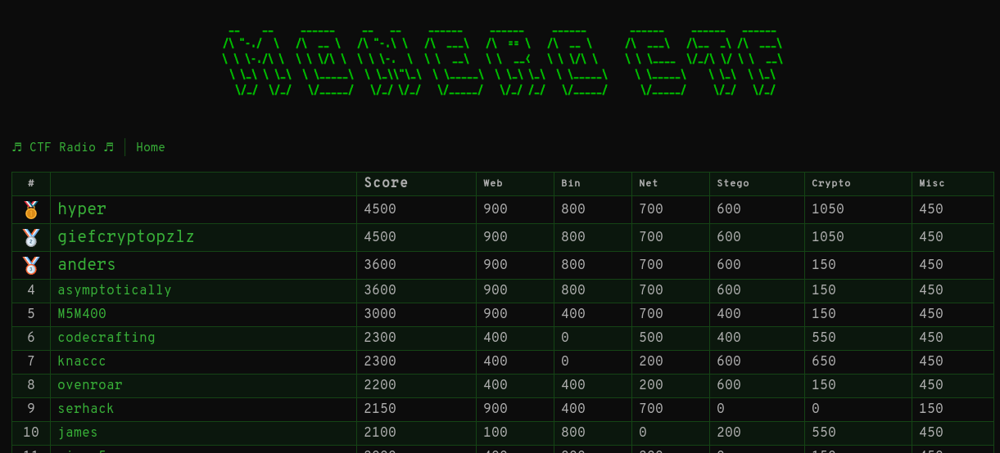
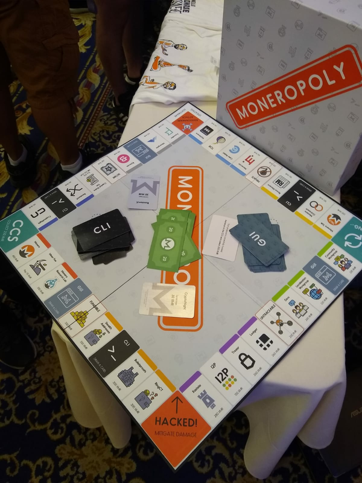
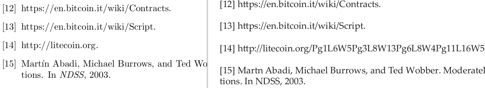
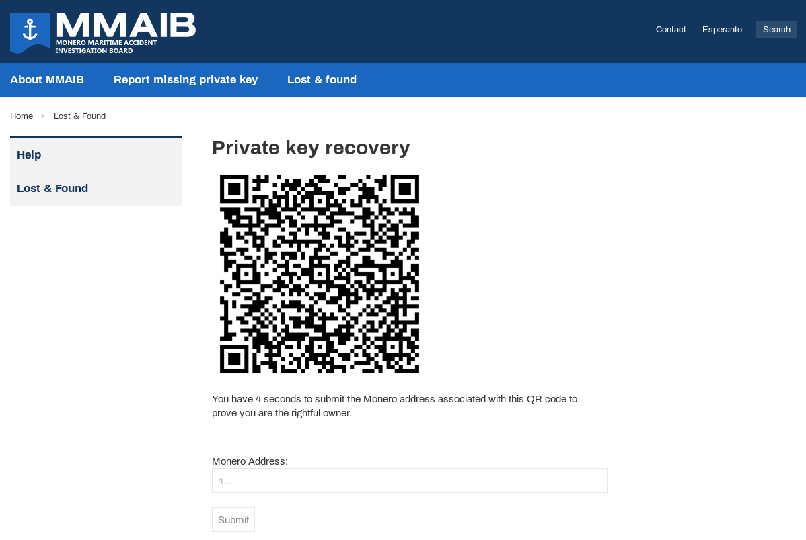
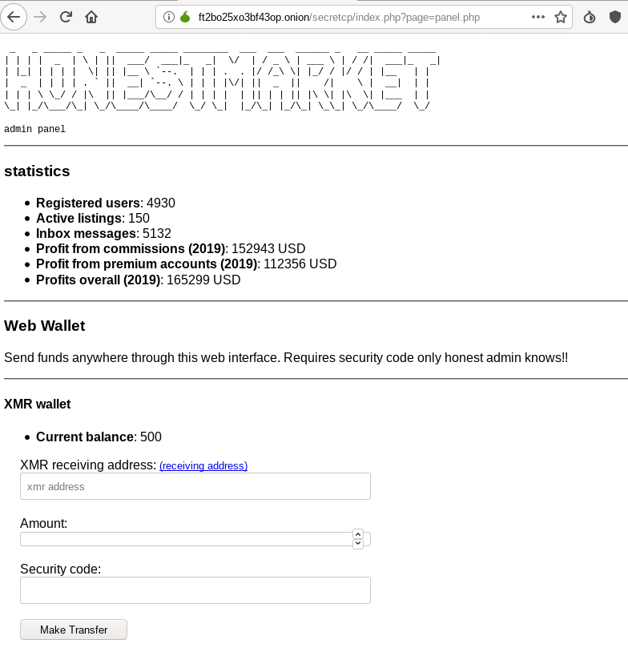

Monero CTF 2019
---

During my first day at DEF CON 27 I played the Monero CTF. The [link to join](https://ctf.xmr.pm) was given out at the Monero village.

Upon registering, an awesome challenge platform, monero-os, booted up and emulated a UNIX environment. I was hooked and worked hard on the challenges all day, eventually taking first place and winning a 'Moneropoly' board game :)





Below are writeups of my favourite challenges from the competition.

### crypto400

```
Hey there, super sleuth. The research team is looking for some help,
since we're pretty busy with the DEF CON village. Apparently some no-goodniks
are planning a big heist on one of the most famous fictional casinos
in history, but nobody knows which one.
If you're up for the challenge, help us out! Oh, and don't worry
about any complicated codebase for this. I know SarangNoether
keeps some Python tools in a repo for just such an occasion.
http://sarang.geocities.xmr.pm
```

We browsed the hilariously stereotypical Geocities page including marquees, psyduck GIFs, and copious usage of Comic Sans. It linked to a Github repo containing three stages, each of which involved implementing TODOs in cryptographic code.

The correct implementation of each stage opened the path to solving the next:
 1. A reused nonce across two [Schnorr signatures](https://en.wikipedia.org/wiki/Schnorr_signature) enabled a key recovery attack. The exact attack is described in page 14 of [Zero to Monero](https://www.getmonero.org/library/Zero-to-Monero-1-0-0.pdf).
 1. The recovered key is used in an [RC4 cipher](https://en.wikipedia.org/wiki/RC4), of which we had to implement the simple decrypt operation. This gave us the plaintext: _"Hid the next key as address of testnet transaction df342b32fc8864c31f6f5571ca812c39658d83a0e9664f65e40842e5194ac833"_
 1. The key was subtracted from a Curve25519 scalar and the corresponding point's x co-ordinate led to some text on [Debian Pastezone](https://paste.debian.net/1093725), thus the hint "I think it's posted to debian?"  The paste indicated how to form the flag from a casino in an episode of the Simpsons.

I found the third stage challenging as it required some leaps of logic, but it was very satisfying to solve in the end. The completed code is included in this repo.

### stego300

```
Hey,
Over at Litecoin we are starting to lose faith in the Bitcoin vision.
We don’t want to always be seen as the silver to their
gold. It’s all so boring.
There are some murmurs that we should start to copy some of Monero’s
protocol instead. If we are copycats, might as well copy the best!
Some people are also saying that the white paper has some
coded information hidden in it, but we cannot seem to find it.
We reckon that if we do, we can time the news release about
our change in strategy and pump the price of Litecoin. Charlie
will be delighted with us.
We all just want lambos after all, don’t we?
https://ctf.xmr.pm/oFgi4d304fd9gsdIO/stego300.pdf
The flag is in the format
CTF{MD5(hidden_message)}
```

We were given a version of the Cryptonote whitepaper PDF. It had clearly been recompiled as it used a different font and was five times the filesize of the original whitepaper. At first we suspected that there was some invisible object &ndash; possibly JavaScript &ndash; embedded in the document, and we spent a while inspecting the PDF with [peepdf](https://github.com/jesparza/peepdf).

Going back to the challenge description, it appeared to be hinting about Litecoin. Searching for "Litecoin" in the PDF, we found an interesting difference to the original whitepaper:



Rather than being part of a valid URL, the string Pg1L6W5Pg3L8W13Pg6L8W4Pg11L16W5 was actually a [book cipher](https://en.wikipedia.org/wiki/Book_cipher):

```
Page 1 Line 6 Word 5
Page 3 Line 8 Word 13
Page 6 Line 8 Word 4 
Page 11 Line 16 Word 5
```

After concatenating these words to form the string `electronicvalueremainswithin` and hashing it, we had the flag.

### web200

```
Bro,
I seem to have lost my private keys in a tragic boating accident :((
Help me recover them plz: http://lulz.ctf.xmr.pm/poejg4GmvEK4oElmF/web200/
lol :|
```

On the website, themed around [fluffypony's tragic boating accident](https://twitter.com/fluffypony/status/943493541182963712?lang=en), there were several areas to explore. Eventually we found a "Private Key Recovery" page:



The way forward was clear. We had to write a script which:
 - Downloads the QR code from the page.
 - Parses the QR code for a Monero seed phrase.
 - Gets an address of a Monero seed.
 - Submits the address to the website.

This looked like a job for a Python script, and after half an hour of gluing libraries together, we had the flag.

### web300

```
Hi friend,
We believe HonestMarket is doing an exit-scam. So far they have shut down all
crypto-currency withdrawals.
Infiltrate the market and find a way into their admin panel
to "secure" the funds before they can exit-scam themselves.
We tried to brute-force our way in, no dice. We need your k-kewl
31337 pentesting techn1queZ. You need to hack it!
Find Honest-Market at http://ft2bo25xo3bf43op.onion
```

After visiting the Onion service on Tor browser and entering our PIN, we were logged into a darknet market which was apparently based on code of a real darknet market &ndash; a fantastic idea for a challenge.

There was a lot to explore but after manual testing we soon found a parameter which was vulnerable to SQL injection. To automatically exploit this and pull admin credentials out of database, we fired up sqlmap:

```
sqlmap --tor --tor-type=SOCKS5 -u 'http://ft2bo25xo3bf43op.onion/profile/wish-list/?name=burninate' --cookie='ctfdnm_uid=47f054cd-7231-4ea1-8624-37b716537672' --dump -T "users" --where="admin=true"
```

In retrospect it wasn't difficult to manually exploit this leak either with a URL such as:
http://ft2bo25xo3bf43op.onion/profile/wish-list/?name=burninate%27%20union%20select%20cast(username%20as%20integer)%20%20from%20users%20WHERE%20admin=true;%20--

The admin password hash cracked easily to "monero". We could now login to the admin panel which was linked in the HTML:



We clearly had to transfer all the money out of the market to our address. But a naive attempt to do so led to a "bad security code" error. So we looked for another security issue.

Playing with the `page` parameter, we discovered a [local file inclusion](https://en.wikipedia.org/wiki/File_inclusion_vulnerability#Local_file_inclusion) vulnerability. By using a [PHP filter to base64 encode the source code](https://www.idontplaydarts.com/2011/02/using-php-filter-for-local-file-inclusion/) of the panel.php page before rendering it, we recovered the code:

```
http://ft2bo25xo3bf43op.onion/secretcp/index.php?page=php://filter/convert.base64-encode/resource=panel.php
```
Transferring all the funds out of the market gave us the flag.

---

A big thank you to [dsc](https://twitter.com/xmrdsc) and all others involved in creating this awesome set of challenges. 
